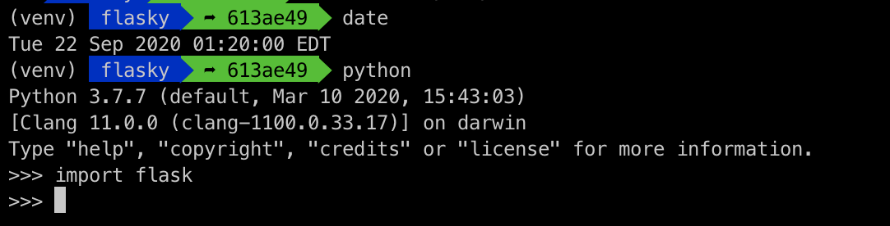
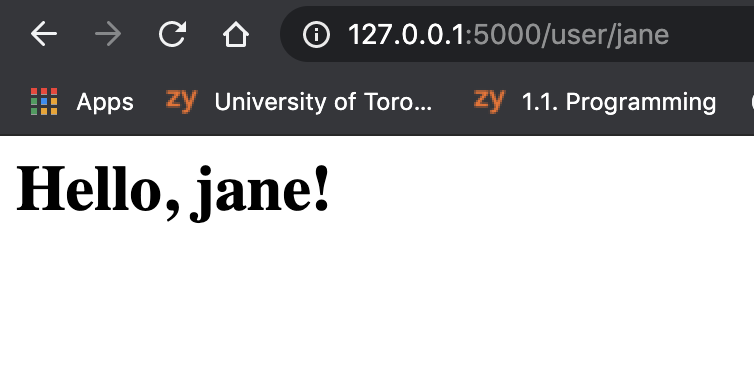

# ECE444-F2020-Lab2

## Activity 1

## Activity 2

Jane Illarionova Lab 2 Repository

This repo is a clone of https://github.com/miguelgrinberg/flasky

Screenshot of Hello, Jane flask app for activity 2:

## Activity 3

Flask context globals expose certain objects 'gloablly' within the context of each thread. This enables the data from the given object to be accessed by functions in this instance of the app. There are two types of contexts: application contexts and request contexts. These contexts are made available before handling a request, and removed once done; current_app and g are application contexts and represent an application instance and temporary storage, respectively; request and session are request contexts and hold the data of the current HTTP request, and store data between requests. 
